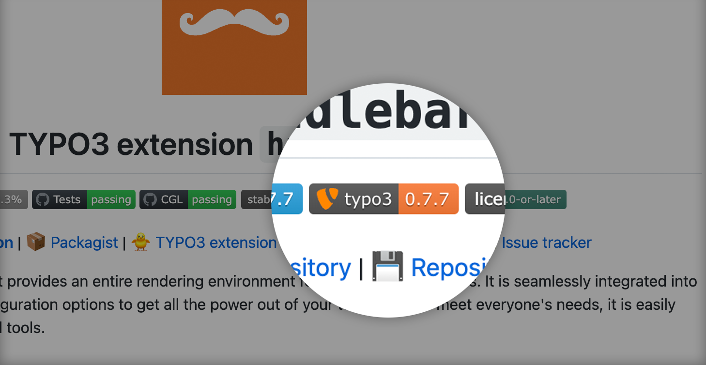

# Badges for TYPO3 extensions

**:computer:&nbsp;[Official website](https://typo3-badges.dev)** |
:package:&nbsp;[Packagist](https://packagist.org/packages/eliashaeussler/typo3-badges) |
:floppy_disk:&nbsp;[Repository](https://github.com/eliashaeussler/typo3-badges) |
:bug:&nbsp;[Issue tracker](https://github.com/eliashaeussler/typo3-badges/issues)

A Symfony project that provides endpoints for beautiful TYPO3 badges. Pimp all your
extension documentation with badges for e.g. extension version or TER downloads. All
endpoints provide JSON configuration for use with
[Shields.io](https://shields.io/endpoint) or [Badgen](https://badgen.net/https).

## :zap: Usage

An overview of all endpoints and their usage can be found on the
[official website](https://typo3-badges.dev).

## :star: License

This project is licensed under [GNU General Public License 3.0 (or later)](LICENSE).
