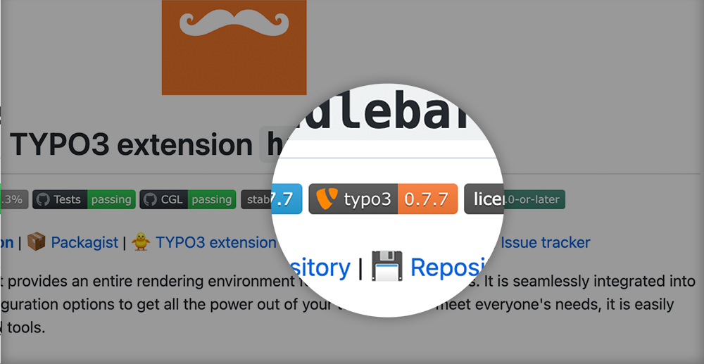

<div align="center">



# Badges for TYPO3 extensions

[](https://sonarcloud.io/dashboard?id=eliashaeussler_typo3-badges)
[](https://github.com/eliashaeussler/typo3-badges/actions/workflows/deploy.yaml)
[](https://github.com/eliashaeussler/typo3-badges/actions/workflows/tests.yaml)
[](https://github.com/eliashaeussler/typo3-badges/actions/workflows/cgl.yaml)
[](LICENSE)
[](https://badges.typo3-web.dev)

**:computer:&nbsp;[Official website](https://badges.typo3-web.dev)** |
:package:&nbsp;[Packagist](https://packagist.org/packages/eliashaeussler/typo3-badges) |
:floppy_disk:&nbsp;[Repository](https://github.com/eliashaeussler/typo3-badges) |
:bug:&nbsp;[Issue tracker](https://github.com/eliashaeussler/typo3-badges/issues)

</div>

A Symfony project that provides endpoints for beautiful TYPO3 badges. Pimp all your
extension documentation with badges for extension versions or TER downloads. All
endpoints provide JSON configuration for use with
[Shields.io](https://shields.io/endpoint).

## :zap: Usage

Base URL: `https://badges.typo3-web.dev`

> **Note:**
>
> All endpoints return only the JSON configuration for
> [Shields.io](https://shields.io/endpoint). The actual badges are still rendered via
> Shields.io: `https://shields.io/endpoint?url=<endpoint>`

### Badge for current extension version

Endpoint: `/badge/{extension}/version`

**Example (Markdown):**

```markdown

```

**Result:**


### Badge for total extension downloads

Endpoint: `/badge/{extension}/downloads`

**Example (Markdown):**

```markdown

```

**Result:**


### Badge for extension key

Endpoint: `/badge/{extension}/extension`

**Example (Markdown):**

```markdown

```

**Result:**


### Badge for extension stability

Endpoint: `/badge/{extension}/stability`

**Example (Markdown):**

```markdown

```

**Result:**


### Generic TYPO3 badge

Endpoint: `/badge/typo3`

**Example (Markdown):**

```markdown

```

**Result:**


## :star: License

This project is licensed under [GNU General Public License 3.0 (or later)](LICENSE).
